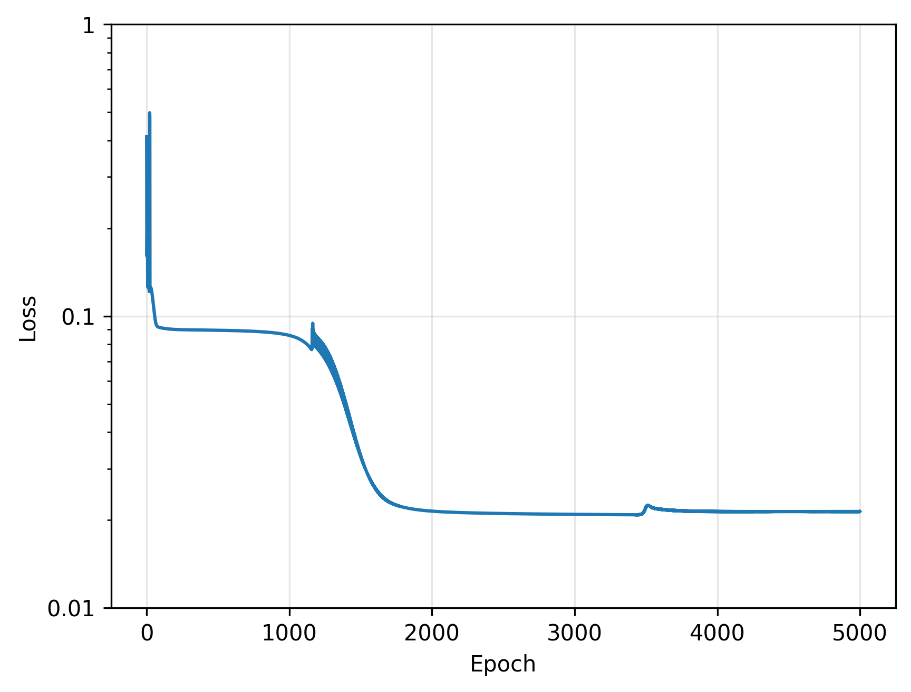
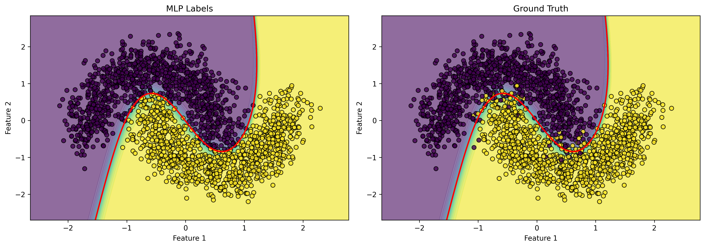

# MLP_Play 🧠

**Learn how neural networks work from scratch!** This project implements a Multi-Layer Perceptron (MLP) from the ground up using PyTorch, with **manual backpropagation** to demonstrate the fundamental mechanics of how neural networks learn.

## 🎯 What You'll Learn

This educational notebook shows you how to:
- 🔢 Build a neural network **without** relying on automatic differentiation
- 📐 Implement forward propagation (how predictions are made)
- 🔄 Implement backward propagation (how networks learn from mistakes)
- 📊 Train a classifier on the classic "moons" dataset
- 🎨 Visualize decision boundaries to see what the network learned

## 🚀 Quick Start

### Installation

1. Clone this repository
2. Install dependencies:
```bash
pip install -r requirements.txt
```

Or for GPU support (CUDA 12.6):
```bash
pip install -r requirements.txt --index-url https://download.pytorch.org/whl/cu126
```

### Run the Notebook

```bash
jupyter lab notebooks/mlp.ipynb
```

## 📓 What's Inside

The notebook demonstrates a **simple 2-layer neural network** that learns to classify non-linearly separable data:

- **Input Layer**: 2 features (x, y coordinates)
- **Hidden Layer**: 4 neurons with sigmoid activation
- **Output Layer**: 1 neuron for binary classification

### Why Manual Backpropagation?

Most tutorials use frameworks that hide the math. This notebook **shows you the actual gradient calculations** so you understand:
- How errors propagate backward through layers 🔙
- How gradients are computed using the chain rule 🔗
- How weights are updated via gradient descent 📉

## 🎓 Educational Features

✨ **Heavily commented code** - Every line explains what and why
📊 **Visualizations** - See the training data, loss curves, and decision boundaries
🔬 **Mathematical explanations** - Gradient formulas and activation derivatives included
🎯 **97%+ accuracy** - Watch the network learn to separate the moons!

## 🌙 The Moons Dataset

The notebook uses scikit-learn's `make_moons` dataset - two interleaving half-circles that can't be separated by a straight line. This demonstrates why we need **non-linear activations** in neural networks.


*Training and testing data split - notice the two crescent shapes that interleave*

## 📈 Example Results

### Training Progress

Watch the network learn! The loss curve shows how the model improves over 50,000 epochs:


*Loss decreases exponentially as the network learns the pattern*

### Decision Boundary Visualization

See what the network learned! The decision boundary shows how the MLP separates the two classes:


*Left: MLP predictions | Right: Ground truth - The network achieves 97%+ accuracy!*

---

**Perfect for**: Students, developers learning ML fundamentals, or anyone curious about what's really happening inside a neural network! 🎉