# Experiments Guide 🔬

A detailed walkthrough of the two educational experiments in this repository, explaining what each notebook demonstrates and what you'll learn.

## Table of Contents

1. [Overview](#overview)
2. [Experiment 1: Moons Classification](#experiment-1-moons-classification)
3. [Experiment 2: Wine Classification](#experiment-2-wine-classification)
4. [Comparing the Experiments](#comparing-the-experiments)
5. [Key Takeaways](#key-takeaways)

---

## Overview

This repository contains two complementary experiments designed to teach different aspects of Multi-Layer Perceptrons:

| Experiment | Type | Implementation | Key Learning |
|------------|------|----------------|--------------|
| **Moons** | Binary Classification | Manual Backpropagation | Understanding the mathematics |
| **Wine** | Multi-Class Classification | PyTorch Framework | Modern best practices |

Both experiments share a common structure:
1. 📊 Data loading and preprocessing
2. 🎨 Exploratory visualisation
3. 🏗️ Network architecture definition
4. 🔄 Training loop
5. 📈 Performance evaluation
6. 🧠 Hidden layer analysis

---

## Experiment 1: Moons Classification

**Location:** `notebooks/moons.ipynb`

### What You'll Learn

This experiment teaches the **fundamental mathematics** of neural networks by implementing everything from scratch:

✅ Manual weight initialisation
✅ Forward propagation step-by-step
✅ Loss computation (Mean Squared Error)
✅ Gradient calculations using calculus
✅ Weight updates via gradient descent
✅ Decision boundary visualisation

### The Dataset: Make Moons

The moons dataset consists of **two interleaving half-circles** that cannot be separated by a straight line. This demonstrates why neural networks need **non-linear activation functions**.

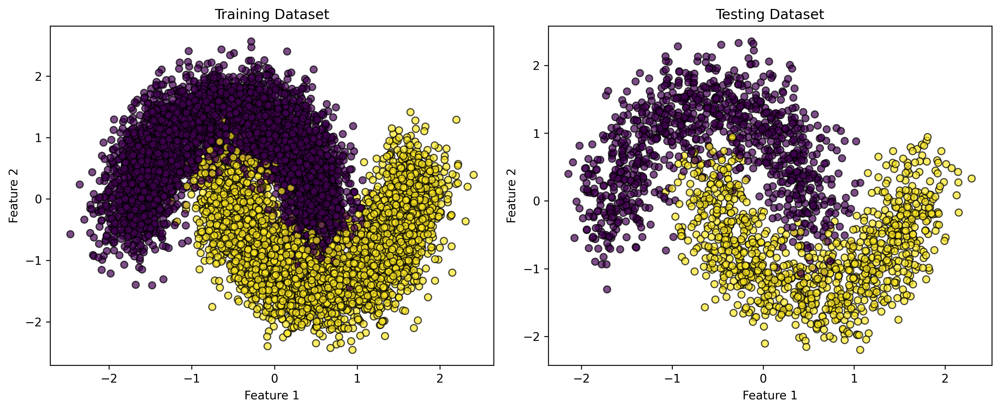
*Two crescent-shaped classes with controlled noise (10,000 samples)*

**Dataset Properties:**
- 10,000 samples (8,000 training, 2,000 testing)
- 2 features (x, y coordinates)
- 2 classes (binary classification)
- 20% noise for realistic difficulty

### Network Architecture

```
Input Layer (2)  →  Hidden Layer (4)  →  Output Layer (1)
                     [Sigmoid]              [Sigmoid]
```

**Why this architecture?**
- **2 inputs:** The (x, y) coordinates
- **4 hidden neurones:** Enough to learn the curved boundary
- **Sigmoid activation:** Smooth, differentiable, bounded [0,1]
- **1 output:** Probability of belonging to class 1

### Training Configuration

```python
Epochs: 20,000
Learning Rate: 0.1
Batch Size: Full batch (all 8,000 samples)
Loss Function: Mean Squared Error
Optimiser: Vanilla Gradient Descent (manual)
```

### Training Progress

The loss decreases exponentially, showing the network is learning:

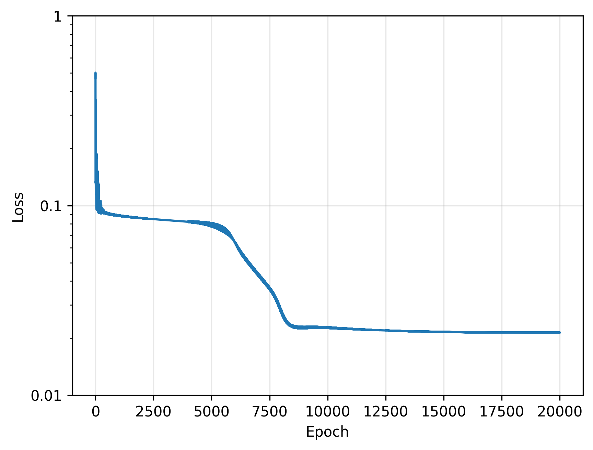
*Loss curve on logarithmic scale - notice the rapid initial descent*

**Key Observations:**
- Loss starts around 0.25 (random guessing)
- Decreases rapidly in first 1,000 epochs
- Converges to ~0.01 after 5,000 epochs
- Logarithmic scale reveals continued improvement

### Results: Decision Boundary

The trained network achieves **~96-97% accuracy** and learns a smooth decision boundary:

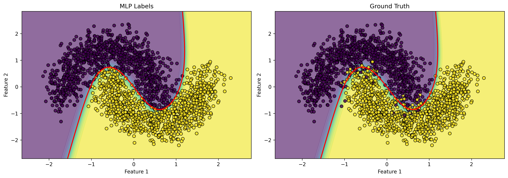
*Left: Network predictions | Right: Ground truth labels*

**What to Notice:**
- The red line is the decision boundary (50% probability)
- Coloured regions show predicted class probabilities
- The network correctly captures the crescent shapes
- Misclassifications occur primarily in overlapping regions

### Hidden Layer Analysis

Each of the 4 hidden neurones learns to detect different spatial patterns:

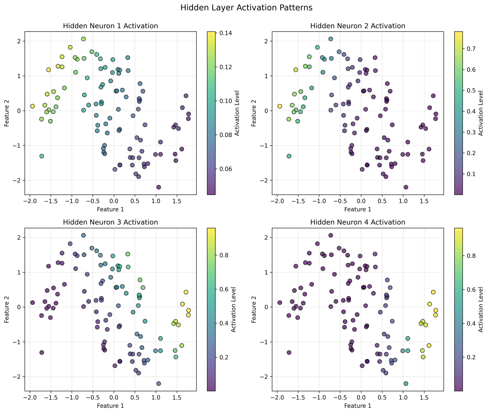
*Activation levels for each neurone across the input space*

**Interpreting the Activations:**
- **Neurone 1:** Might activate strongly on the left side
- **Neurone 2:** Might activate strongly on the right side
- **Neurone 3 & 4:** Detect vertical or radial patterns

Different training runs produce different neurone specialisations, but all achieve similar accuracy!

### Activation Heatmap

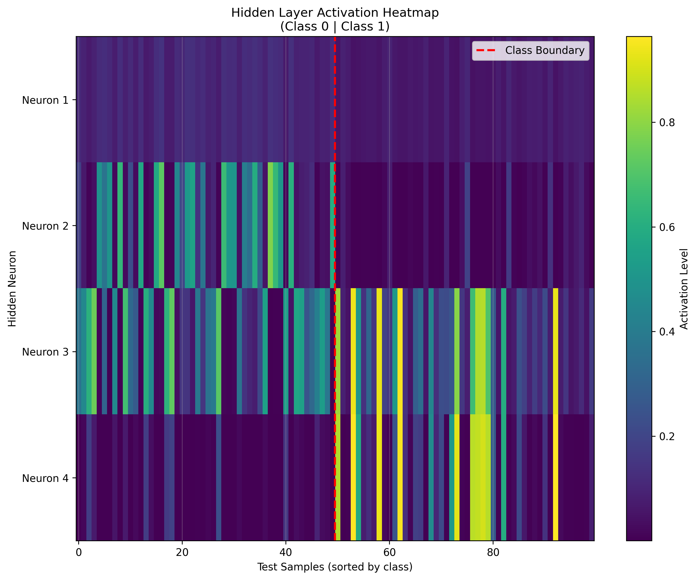
*Rows = neurones, Columns = test samples (sorted by class)*

**What This Shows:**
- Clear patterns emerge for each class
- Some neurones are more active for class 0, others for class 1
- The network internally represents data in a 4-dimensional space
- This higher-dimensional representation enables linear separability

### Code Highlights

**Manual Gradient Computation:**
```python
# Output layer gradients
dz2 = output - y
dW2 = torch.matmul(self.a1.T, dz2)
db2 = torch.sum(dz2, axis=0) / m

# Hidden layer gradients (chain rule!)
da1 = torch.matmul(dz2, self.W2.T)
dz1 = da1 * (self.a1 * (1 - self.a1))  # Sigmoid derivative
dw1 = torch.matmul(X.T, dz1) / m
```

This is the **heart of backpropagation** - pure mathematics, no magic!

---

## Experiment 2: Wine Classification

**Location:** `notebooks/wine.ipynb`

### What You'll Learn

This experiment demonstrates **modern neural network practices** for multi-class classification:

✅ Handling high-dimensional data (13 features)
✅ Multi-class classification (3 classes)
✅ Using PyTorch's built-in layers and optimisers
✅ Cross-entropy loss for probabilistic outputs
✅ Comprehensive evaluation metrics (ROC, confusion matrix)
✅ Exploratory data analysis (PCA, correlations)

### The Dataset: Wine Cultivars

The wine dataset contains **chemical analyses** of wines from three different cultivars in Italy.

**Dataset Properties:**
- 178 samples (124 training, 54 testing)
- 13 features (alcohol, acidity, phenols, colour intensity, etc.)
- 3 classes (wine cultivars 0, 1, 2)
- Real-world data from UCI Machine Learning Repository

**Features Include:**
- Alcohol content
- Malic acid
- Ash, Alkalinity of ash
- Magnesium
- Total phenols, Flavanoids
- Nonflavanoid phenols
- Proanthocyanins
- Colour intensity, Hue
- OD280/OD315 of diluted wines
- Proline

### Exploratory Data Analysis

Before building the network, we analyse the data to understand patterns:

#### Feature Correlations

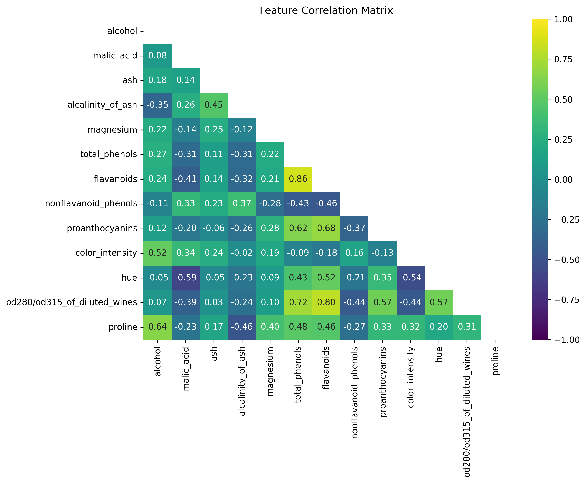
*Heatmap showing relationships between chemical properties*

**Key Insights:**
- Some features are highly correlated (e.g., Flavanoids & Total Phenols)
- Could potentially reduce dimensionality
- Helps understand which features might be most discriminative

#### PCA Visualisation

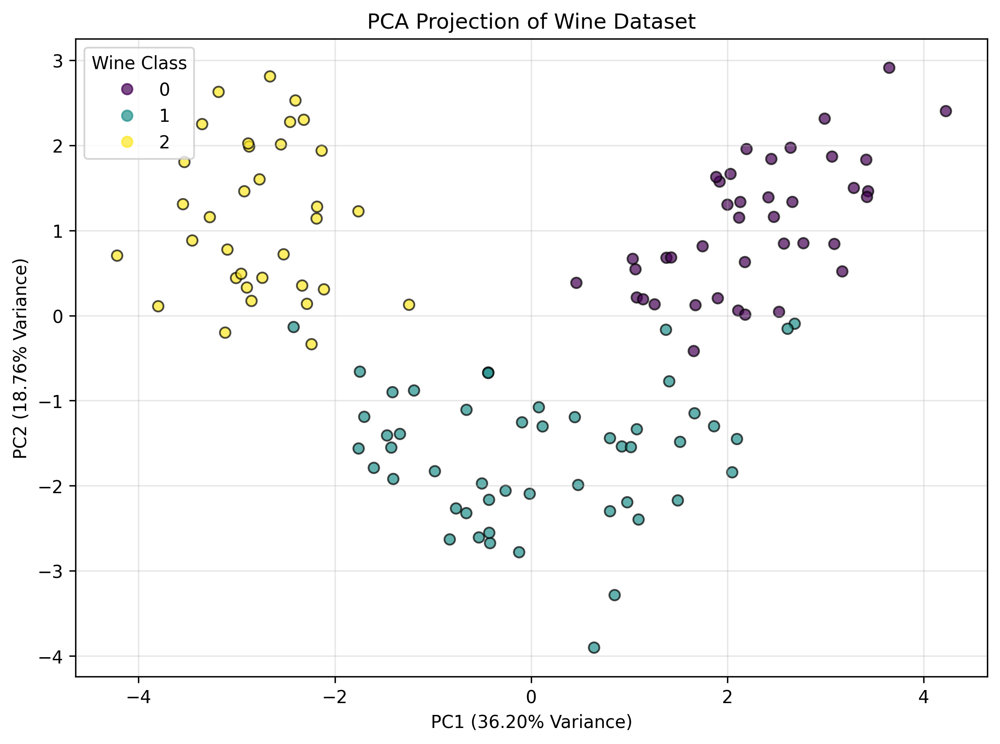
*Three wine classes projected onto first two principal components*

**What This Reveals:**
- The three classes are reasonably well-separated
- PC1 captures 36.2% of variance, PC2 captures 19.2%
- Together, ~55% of information in just 2 dimensions
- Some overlap suggests the task is challenging but achievable

#### Pairwise Relationships

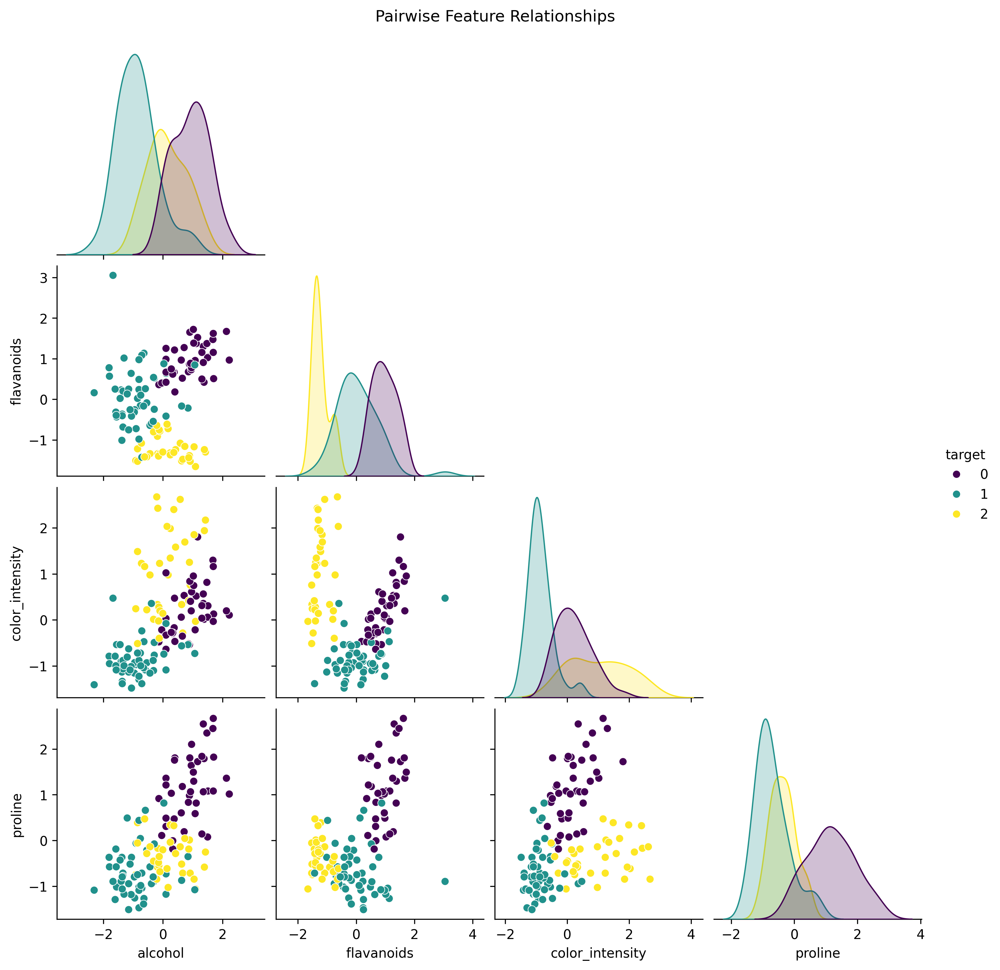
*Scatter plots for selected feature pairs*

**Selected Features:**
- Alcohol, Flavanoids, Colour Intensity, Proline
- Shows clear separation patterns for some feature combinations
- Diagonal shows probability distributions for each class

### Network Architecture

```
Input Layer (13)  →  Hidden Layer (64)  →  Output Layer (3)
                      [ReLU]                [Softmax via CrossEntropy]
```

**Why this architecture?**
- **13 inputs:** All chemical measurements
- **64 hidden neurones:** Sufficient capacity for complex patterns
- **ReLU activation:** Modern standard, avoids vanishing gradients
- **3 outputs:** One logit per wine class (converted to probabilities)

### Training Configuration

```python
Epochs: 20,000
Learning Rate: 0.01
Batch Size: Full batch (all 124 samples)
Loss Function: Cross-Entropy Loss
Optimiser: Adam (adaptive learning rates)
Device: GPU if available (CUDA/MPS)
```

### Training Progress

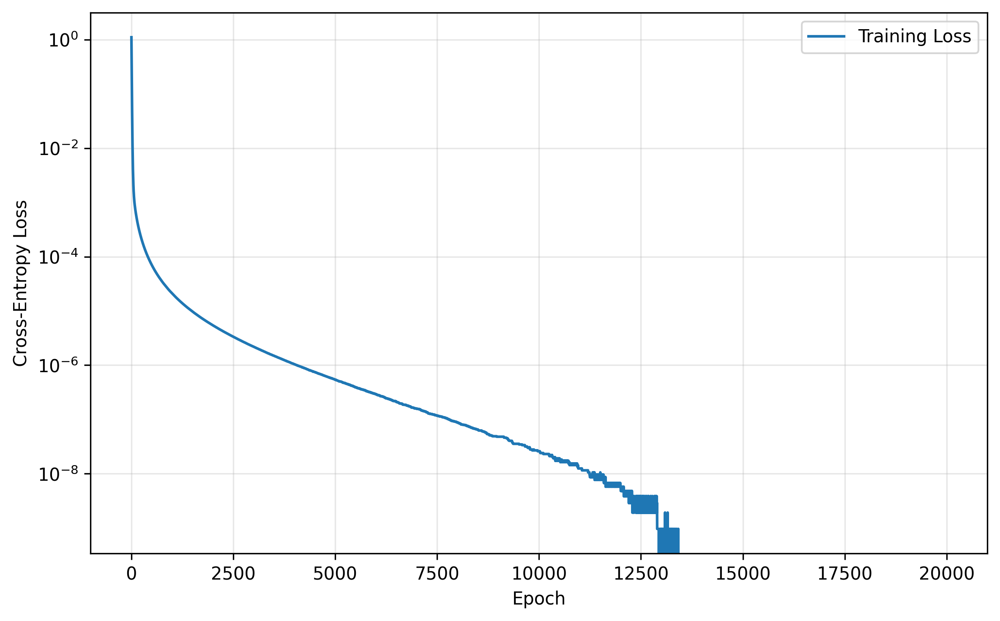
*Cross-entropy loss decreases rapidly then stabilises*

**Training Dynamics:**
- Initial loss ~1.14 (random guessing for 3 classes)
- Drops to near-zero within 5,000 epochs
- Final loss < 0.00001 (nearly perfect on training set)
- Test accuracy: **98.15%** throughout final epochs

### Performance Evaluation

#### Confusion Matrix

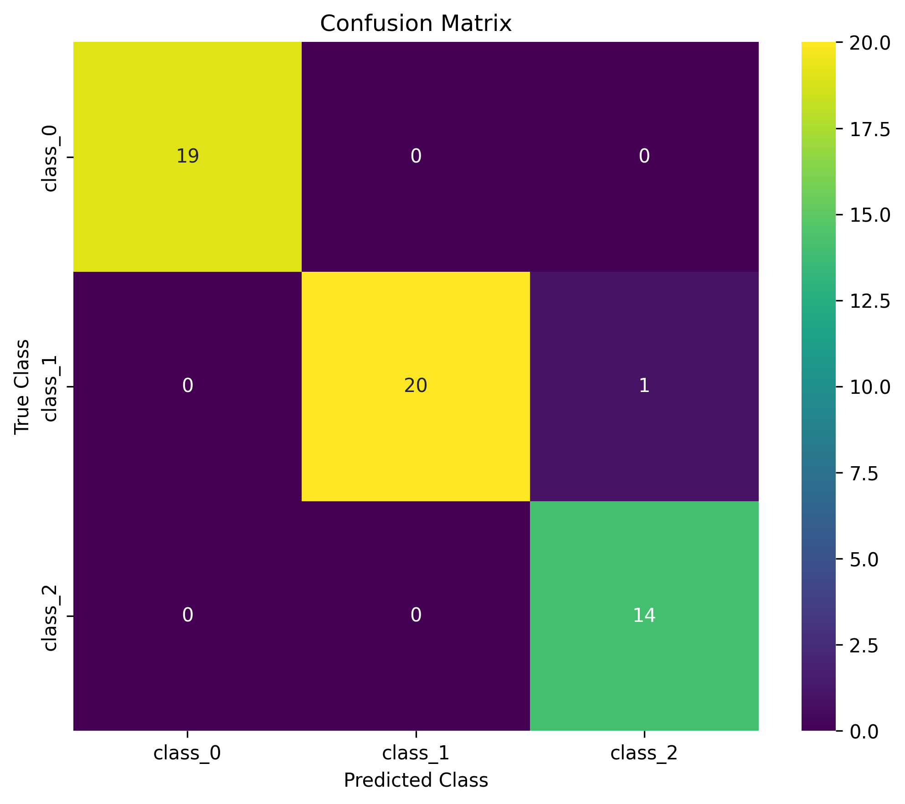
*Predicted vs. true labels for all three wine classes*

**Reading the Matrix:**
- Diagonal elements: Correct predictions
- Off-diagonal: Misclassifications
- Near-perfect performance with only 1-2 mistakes
- Class 1 may have slightly more errors (smaller sample size)

#### ROC Curves

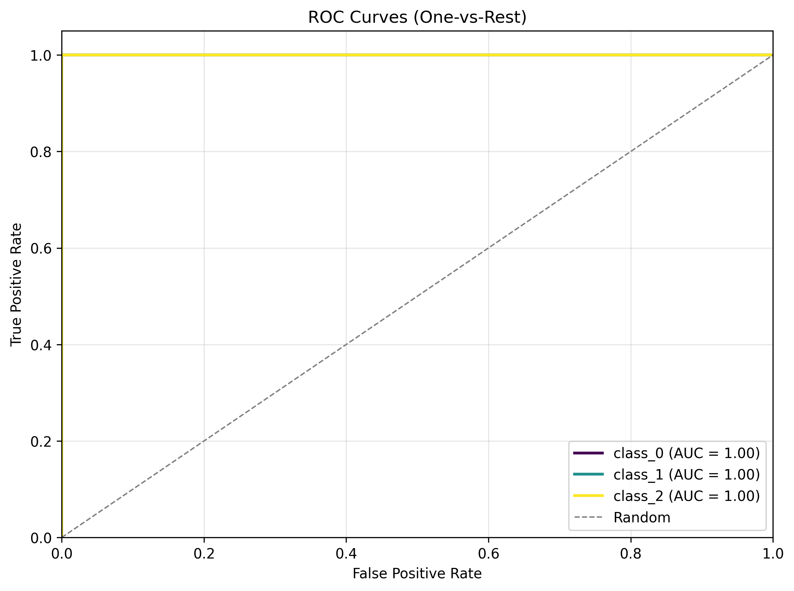
*Receiver Operating Characteristic curves for each class*

**Understanding ROC:**
- Plots True Positive Rate vs. False Positive Rate
- Area Under Curve (AUC) summarises performance
- AUC = 1.0: Perfect classifier
- AUC = 0.5: Random guessing (diagonal line)
- All three classes achieve AUC > 0.99: Excellent!

### Hidden Layer Analysis

#### Activation Heatmap

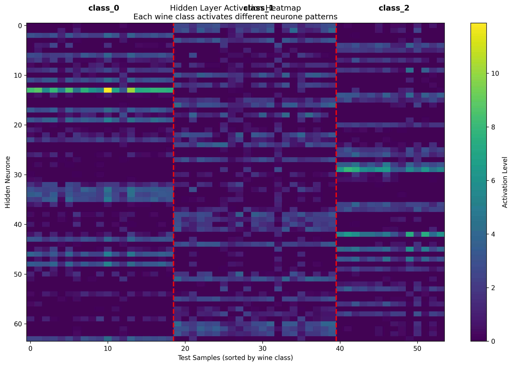
*All 64 neurones' activations across test samples (grouped by wine class)*

**What This Reveals:**
- Each wine class produces distinct activation patterns
- Some neurones are highly active for specific classes
- Vertical stripes show class-specific "signatures"
- The network learns distributed representations

#### Average Activations by Class

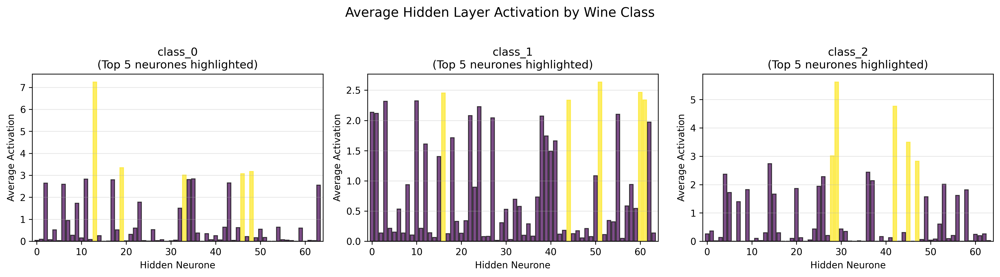
*Mean activation for each neurone, split by wine class*

**Key Insights:**
- Top 5 most active neurones highlighted in yellow
- Different neurones specialise in detecting different wine types
- Some neurones are class-specific, others respond to multiple classes
- This specialisation emerges automatically from training!

### Code Highlights

**PyTorch Implementation:**
```python
class SimpleMLP(nn.Module):
    def __init__(self, n_input, n_hidden, n_output):
        super(SimpleMLP, self).__init__()
        self.layer1 = nn.Linear(n_input, n_hidden)
        self.relu = nn.ReLU()
        self.layer2 = nn.Linear(n_hidden, n_output)

    def forward(self, x):
        return self.layer2(self.relu(self.layer1(x)))
```

Much cleaner than manual implementation—PyTorch handles gradients automatically!

**Training Loop:**
```python
for epoch in range(20000):
    logits = model(X_train_t)
    loss = criterion(logits, y_train_t)

    optimizer.zero_grad()
    loss.backward()  # Automatic backpropagation!
    optimizer.step()
```

---

## Comparing the Experiments

### Side-by-Side Comparison

| Aspect | Moons Experiment | Wine Experiment |
|--------|------------------|-----------------|
| **Dataset** | Synthetic (10k samples) | Real-world (178 samples) |
| **Features** | 2 (coordinates) | 13 (chemical properties) |
| **Classes** | 2 (binary) | 3 (multi-class) |
| **Architecture** | 2-4-1 | 13-64-3 |
| **Activation** | Sigmoid | ReLU |
| **Loss** | MSE | Cross-Entropy |
| **Optimiser** | Manual SGD | Adam |
| **Implementation** | From scratch | PyTorch |
| **Accuracy** | ~96-97% | ~98% |
| **Training Time** | ~30 seconds | ~1 minute |

### Pedagogical Progression

The experiments are designed to build understanding progressively:

1. **Moons teaches fundamentals:**
   - Start simple (2D data, binary classification)
   - See every mathematical step
   - Build intuition for backpropagation
   - Understand gradient flow

2. **Wine teaches practice:**
   - Scale to real problems (13D data, multi-class)
   - Use modern tools (PyTorch, Adam)
   - Comprehensive evaluation (ROC, confusion matrix)
   - Production-ready code patterns

### When to Use Each Approach

**Manual Implementation (Moons style):**
- ✅ Learning how neural networks work
- ✅ Debugging and understanding gradients
- ✅ Teaching and presentations
- ✅ Small-scale problems

**Framework Implementation (Wine style):**
- ✅ Production systems
- ✅ Large-scale problems
- ✅ Rapid prototyping
- ✅ Modern best practices

---

## Key Takeaways

### From Moons Experiment

1. **Mathematics is accessible:** Backpropagation is just the chain rule applied systematically
2. **Activation functions matter:** Without sigmoid, the network would be purely linear
3. **Hidden layers create features:** 4 neurones transform 2D input into 4D representation
4. **Decision boundaries emerge:** The network discovers the curved separation automatically
5. **Manual implementation is educational:** Seeing every step builds deep understanding

### From Wine Experiment

1. **Feature exploration is crucial:** PCA and correlation analysis guide architecture choices
2. **More data dimensions need more capacity:** 64 neurones vs. 4 for the simpler problem
3. **ReLU is the modern standard:** Faster training, no vanishing gradients
4. **Cross-entropy for classification:** Probabilistically motivated, better gradients
5. **PyTorch handles complexity:** Automatic differentiation scales effortlessly

### Universal Lessons

🎯 **Network capacity must match problem complexity**
- Too few neurones → underfitting
- Too many neurones → overfitting (though we don't see this with our small networks)

📊 **Visualisation builds intuition**
- Loss curves show training progress
- Decision boundaries reveal what was learnt
- Activation patterns explain internal representations

🔬 **Experimentation is key**
- Try different architectures
- Adjust learning rates
- Compare activation functions
- Measure everything

---

## Extending the Experiments

### Suggested Modifications

#### Easy (Beginner)
1. Change the number of hidden neurones (try 2, 8, 16)
2. Adjust the learning rate (0.01, 0.05, 0.2)
3. Train for more/fewer epochs
4. Add more noise to the moons dataset

#### Intermediate
1. Implement a 3-layer network (2-8-4-1 for moons)
2. Add learning rate decay
3. Try different activation functions (tanh, leaky ReLU)
4. Implement mini-batch training
5. Add L2 regularisation

#### Advanced
1. Implement dropout for regularisation
2. Add batch normalisation
3. Use learning rate schedules
4. Implement early stopping
5. Try different datasets (make_circles, iris, breast cancer)
6. Visualise the loss landscape

### Debugging Tips

**If training isn't working:**
- ✅ Check your data is normalised/standardised
- ✅ Verify loss is decreasing (even slowly)
- ✅ Try a smaller learning rate
- ✅ Increase network capacity
- ✅ Check for NaN values in gradients

**If accuracy is poor:**
- ✅ Train for more epochs
- ✅ Increase hidden layer size
- ✅ Try different activation functions
- ✅ Check for class imbalance
- ✅ Visualise decision boundary

**If training is too slow:**
- ✅ Increase learning rate (carefully!)
- ✅ Use Adam instead of SGD
- ✅ Enable GPU acceleration
- ✅ Reduce network size
- ✅ Use mini-batches

---

## Next Steps

After mastering these experiments, you're ready for:

1. **Convolutional Neural Networks (CNNs)**
   - Apply MLPs to image data
   - Learn about convolution and pooling
   - Build image classifiers

2. **Recurrent Neural Networks (RNNs)**
   - Handle sequential data
   - Learn about LSTM and GRU
   - Build language models

3. **Advanced Topics**
   - Attention mechanisms
   - Transformers
   - Generative models (GANs, VAEs)
   - Reinforcement learning

4. **Theoretical Deep Dives**
   - Universal approximation theorem
   - Optimisation landscapes
   - Generalisation and overfitting
   - Theoretical guarantees

---

## Additional Resources

### Datasets to Try
- **Iris Dataset:** 4 features, 3 classes (flowers)
- **Breast Cancer:** 30 features, 2 classes (diagnosis)
- **Digits:** 64 features, 10 classes (handwritten digits)
- **Make Circles:** 2 features, 2 classes (concentric circles)

### Code Repositories
- [PyTorch Examples](https://github.com/pytorch/examples)
- [Fast.ai](https://github.com/fastai/fastai) - High-level deep learning library
- [Keras Examples](https://keras.io/examples/)

### Online Courses
- [Fast.ai Practical Deep Learning](https://course.fast.ai/)
- [Stanford CS231n](http://cs231n.stanford.edu/)
- [DeepLearning.AI Specialization](https://www.deeplearning.ai/)

---

**Ready to run the experiments?** Head back to the [README](../README.md) to get started!

**Want to understand the theory?** Read the [MLP Background](mlp_background.md) guide!
